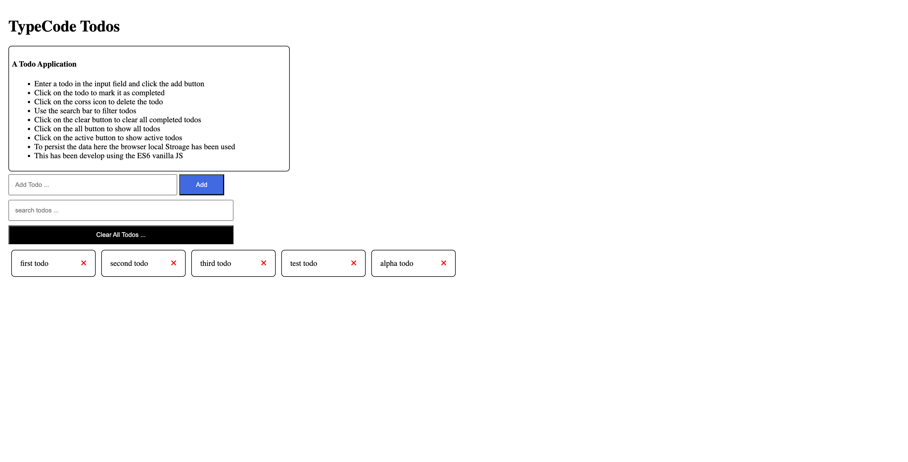

## A Todo Application

- This is a simple todo application that allows users to add, complete, and delete
- todos. It also has the ability to filter todos based on their completion status.
- The application uses the browser's local storage to persist data and is developed
- using ES6 vanilla JavaScript.

